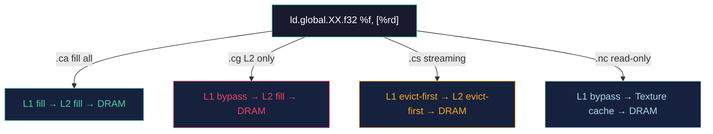
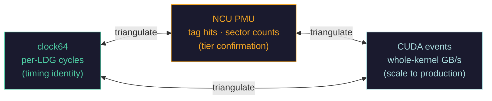
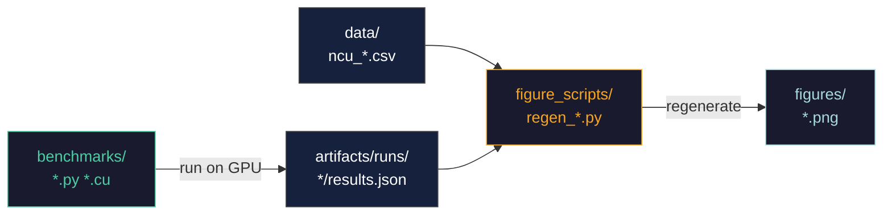
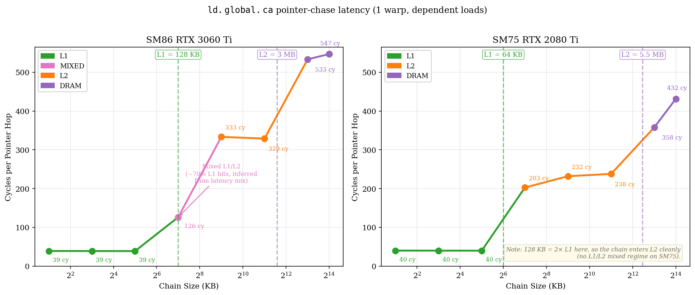
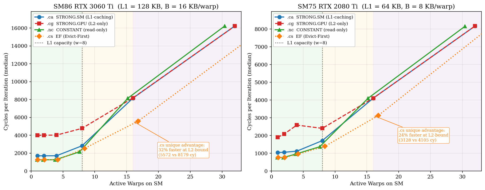
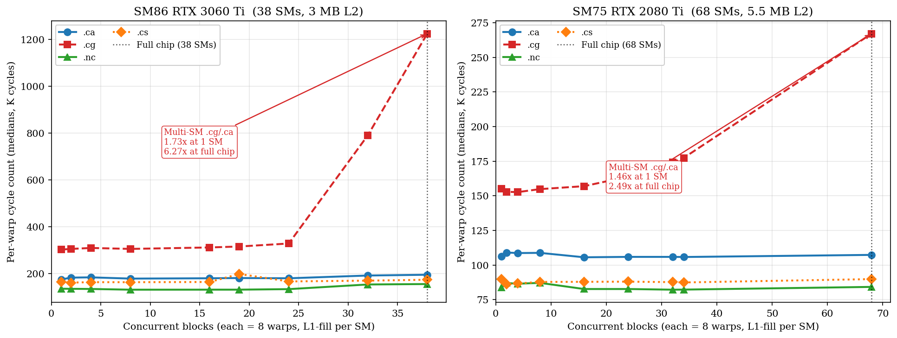
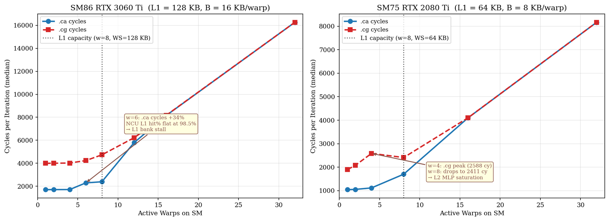
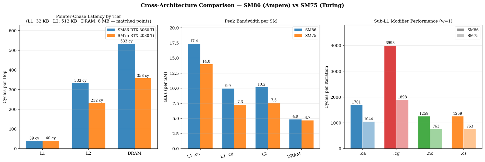
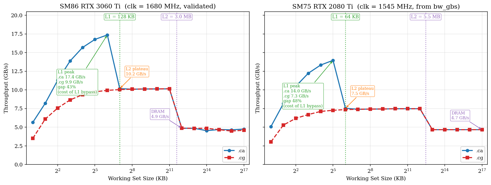

# Cycle-level Profiling of the GPU Cache Hierarchy

> Sub-instruction profiling of PTX cache modifiers on NVIDIA Ampere & Turing

**Pierre Khoury** · BSc Computer Science with Artificial Intelligence · University of Sussex 2025/26  
Supervisor: [Martin Berger](https://profiles.sussex.ac.uk/p23560-martin-berger)


---

## Overview

Modern AI kernels spend most of their cycles moving bytes, not computing. Yet the tools GPU programmers rely on — Nsight Compute, CUDA events — operate at kernel granularity, averaging thousands of memory loads into a single number. A 290-cycle L2 fill can reverse a modifier ranking, and kernel-level profilers cannot see it.

This project builds a **sub-instruction timing methodology** using `clock64` and CS2R reads to bracket individual LDG (load global) instructions, and uses it to characterise all four PTX cache modifiers across working-set size, warp count, and SM count on two GPU generations.

---

## Background: The GPU Cache Hierarchy

Every global load on an NVIDIA GPU travels through up to three tiers before reaching the compute registers. The latency gap between tiers is large and asymmetric:

```
┌─────────────────────────────────────────────────────────────────┐
│  Streaming Multiprocessor (SM)                                  │
│                                                                 │
│  ┌──────────────────────┐                                       │
│  │   L1 / SMEM          │  128 KB per SM   ~  39 cycles         │
│  │   (private per SM)   │  17.4 GB/s per SM                     │
│  └──────────┬───────────┘                                       │
│             │ miss (8.4× penalty)                               │
│  ┌──────────▼───────────┐                                       │
│  │   L2 Cache           │  3 MB shared     ~ 329 cycles         │
│  │   (shared chip-wide) │  10.1 GB/s per SM                     │
│  └──────────┬───────────┘                                       │
│             │ miss                                              │
│  ┌──────────▼───────────┐                                       │
│  │   GDDR6 DRAM         │  8 GB device     ~ 533 cycles         │
│  │   (device-wide)      │  4.9 GB/s per SM                      │
│  └──────────────────────┘                                       │
└─────────────────────────────────────────────────────────────────┘

Latencies measured via pointer-chase on RTX 3060 Ti (SM86 Ampere)
```

---

## The 4 PTX Cache Modifiers

A single PTX instruction — `ld.global.XX.f32 %f, [%rd]` — routes differently through the hierarchy depending on the suffix. Swapping the suffix changes the hardware path without changing the instruction's semantics:

```
ld.global.ca.f32   →   fill L1,         fill L2,        (default)
ld.global.cg.f32   →   bypass L1,       fill L2 only
ld.global.cs.f32   →   evict-first L1,  evict-first L2  (streaming)
ld.global.nc.f32   →   bypass L1,       tex cache path  (read-only)
```



Both CUDA C++ and Triton converge on the same NVPTX intrinsic — the modifier survives `ptxas` lowering and appears as a distinct SASS opcode (`LDG.E.STRONG.SM`, `LDG.E.STRONG.GPU`, `LDG.E.EF`, `LDG.E.CONSTANT`), verified via `cuobjdump`.

---

## Methodology: The Bracket Pattern

The core instrument is two CS2R reads enclosing a single LDG. An FFMA consuming the load result acts as a scoreboard barrier, pinning `t1` until the load retires.

```sass
CS2R  R6,  SR_CLOCKLO           ; t0 = cycle counter
LDG.E.STRONG.SM  R0, [R4]       ; ← one timed load
FFMA  R0,  R0, R118, R22        ; first consumer: scoreboard barrier
CS2R  R7,  SR_CLOCKLO           ; t1 — held until load retires
```

`Δ = t1 − t0` gives per-LDG cycles. Averaging over N repetitions:

- **1 LDG in flight** → measures latency
- **Many LDGs in flight** → measures throughput

Three instruments are used side-by-side for cross-validation:



> Disagreement between instruments is data — not noise. When NCU reports a flat L1 hit rate but `clock64` shows +34% cycles, it reveals an L1 bank conflict invisible to either instrument alone.

**Portability:** the bracket pattern works on any ISA with a free-running cycle counter — `RDTSC` on x86, `rdcycle` on RISC-V, `%clock64` on CUDA.

---

## Experiment Pipeline



---

## Benchmarks

| Script | Experiment | Maps to |
|--------|-----------|---------|
| `clock64_overhead.py` | CS2R read overhead calibration | §3.2 |
| `measure_boost_clock.py` | Cycle → GB/s clock validation | §3.2 |
| `e6_latency_sweep.py` | Pointer-chase latency — resolves L1/L2/DRAM knees | §3.3, §4.2 |
| `e3_all_modifiers.py` | B-reload sweep across all four modifiers | §3.4, §4.4 |
| `e4_warmup_confound.py` | Warmup confound detection and suppression | §3.4 |
| `e5_bandwidth_sweep.py` | Single-warp bandwidth vs working-set size | §4.3 |
| `ncu_e3_launcher.py` | Single-launch kernel for Nsight Compute | §4.1 |
| `ncu_e3_validate_4mods.py` | NCU L1TEX / L2-bytes cross-validation | §4.1 |
| `pearson_recompute.py` | Pearson/Spearman: clock64 vs L1 hit % | §4.1 |
| `multism_launcher.py` | Multi-SM L2 contention scaling | §4.4.1 |
| `triton_elementwise_ws.py` | Triton elementwise SASS decode + WS analysis | §4.5.2 |
| `cross_arch_collapse.py` | SM86 / SM75 cross-architecture replication | §4.4 |
| `cuda_modifier_real_kernels.cu` | Hand-written realistic CUDA modifier kernels | §4.6 |

### Requirements

```
CUDA Toolkit 12.x   (nvcc, cuobjdump, ncu)
Python 3.x          cupy  numpy  scipy  matplotlib
Hardware            NVIDIA Ampere (SM86) or Turing (SM75) GPU
```

### Running

```bash
# Instrument calibration
python3 clock64_overhead.py
python3 measure_boost_clock.py

# Core experiments (0 = SM86 RTX 3060 Ti, 1 = SM75 RTX 2080 Ti)
python3 e6_latency_sweep.py 0
python3 e3_all_modifiers.py 0
python3 e5_bandwidth_sweep.py 0
python3 multism_launcher.py --gpu sm86
python3 cross_arch_collapse.py --gpu 0
python3 triton_elementwise_ws.py

# NCU cross-validation (requires Nsight Compute)
CUDA_VISIBLE_DEVICES=0 python3 ncu_e3_validate_4mods.py --gpu sm86

# Realistic CUDA kernels
nvcc -O3 -arch=sm_86 cuda_modifier_real_kernels.cu -o cuda_modifier_real_kernels
./cuda_modifier_real_kernels
```

Results are written to `artifacts/runs/<experiment>/results.json`.

---

## Results

### Hierarchy Latency — Three Tiers Resolved

The pointer-chase sweep produces three distinct flat plateaus, each corresponding to a cache tier. The same shape appears on both GPU generations, confirming the measurement is architectural and not an artefact.



| Tier | Latency (SM86) | Latency (SM75) |
|------|---------------|---------------|
| L1 / SMEM | ~40 cy | ~28 cy |
| L2 Cache | ~220 cy | ~190 cy |
| GDDR6 DRAM | ~535 cy | ~350 cy |

---

### All Four Modifiers — Working-Set Sweep

With a small working set (fits in L1), all modifiers are fast and nearly identical. As the working set grows, each modifier transitions at a different tier boundary, revealing distinct cost profiles.



```
Working set < 128 KB (L1 capacity on SM86):
  .ca ≈ .nc ≈ .cs  — all served from L1, modifier irrelevant

Working set 128 KB – 3 MB (L2 only):
  .ca fastest  (L1 caching active)
  .cg 4–6×     slower (bypasses L1, hits shared L2)
  .cs moderate (evict-first, no reuse benefit)

Working set > 3 MB (DRAM):
  All modifiers converge — DRAM dominates, modifier choice is moot
```

---

### Multi-SM Scaling — The Hidden Cost of `.cg`

Single-SM benchmarks systematically underestimate the `.cg` penalty in production. As more SMs become active, each bypasses L1 and hammers the shared L2, causing contention to grow nonlinearly.



| Concurrent SMs | `.cg` / `.ca` penalty |
|---|---|
| 1 SM | **1.73×** |
| 38 SMs (full chip) | **6.27×** |

> `.cg` is not just slower than `.ca` — it is a **scaling liability**. The cost measured on a single SM understates production cost by 3.6×.

---

### NCU / clock64 Disagreement — L1 Bank Conflict

At w = 6 warps, NCU reports an unchanged L1 hit rate (98.43%) while `clock64` shows a +34% increase in cycles. Same cache tier, different cost — an L1 bank conflict that is invisible to standard profiling.



| Warps | WS (KB) | L1 hit % | clock64 cycles | Note |
|-------|---------|----------|---------------|------|
| 4 | 64 | 98.43 | 1 711 | — |
| 6 | 96 | 98.43 | **2 290** | +34% — bank conflict |
| 8 | 128 | 78.95 | 2 388 | L1 spill begins |

---

### Cross-Architecture Replication

The same three-tier hierarchy and modifier ranking appears on both SM86 (Ampere) and SM75 (Turing), with tier boundaries tracking each GPU's L1 capacity (128 KB vs 64 KB).



---

### Decision Map — WS × num\_warps → Bandwidth

A full sweep across working-set size and warp count produces a bandwidth landscape for `.ca` vs `.cg`. The peak achievable bandwidth is **6 485 GB/s** at WS = 8, nw = 8. The spread between best and worst configuration is **6.4×** — wrong warp count beats wrong modifier.



---

## Figure Scripts

Each figure in the paper has a dedicated regeneration script:

| Script | Output figure |
|--------|--------------|
| `regen_latency_sweep.py` | `fig_latency_sweep.png` — pointer-chase, 3-plateau hierarchy |
| `regen_all_modifiers.py` | `fig_all_modifiers.png` — four modifiers across working set |
| `regen_bandwidth_sweep.py` | `fig_bandwidth_sweep.png` — bandwidth vs working set |
| `regen_multism.py` | `fig_multism.png` — multi-SM L2 contention scaling |
| `regen_banking_stall.py` | `fig_banking_stall.png` — NCU vs clock64 disagreement |
| `regen_cross_arch.py` | `fig_cross_arch.png` — SM86 / SM75 replication |
| `regen_ncu_full_sweep.py` | `fig_ncu_full_sweep.png` — NCU L1TEX / L2 full sweep |
| `regen_modifier_ranking.py` | `fig_modifier_ranking.png` — per-modifier ranking |
| `regen_modifier_collapse.py` | `fig_modifier_collapse.png` — ranking collapse at DRAM |
| `regen_gbs_sweep.py` | `fig_gbs_sweep.png` — GB/s decision landscape |
| `regen_cs_l2_mechanism.py` | `fig_cs_l2_mechanism.png` — .cs evict-first mechanism |
| `regen_arch_overview.py` | `fig_arch_overview.png` — GPU architecture diagram |

To regenerate all figures at once:

```bash
python3 figure_scripts/generate_figures.py
```

---

## Interactive Demo

`demo/demo.ipynb` runs live on an SSH'd GPU (~40 s on RTX 3060 Ti) and demonstrates all key results interactively:

1. **Hierarchy sweep** — three latency plateaus appear in real time
2. **Warp sweep** — bandwidth drop from nw = 4 → 32
3. **NCU contradiction** — hit rate flat while cost rises
4. **Modifier sweep** — `.cg` 4–6× slower than `.ca`
5. **Decision landscape** — live bandwidth heatmap (WS × num\_warps)

---

## Repository Structure

```
gpu-cache-profiling/
├── benchmarks/          Experiment scripts (Python + CUDA C++)
├── figure_scripts/      Standalone figure regeneration scripts
├── figures/             Pre-generated PNG outputs of all paper figures
├── data/                NCU CSV exports — 12 DL kernels profiled on RTX 3060 Ti
├── demo/                demo.ipynb — interactive live demo
└── references.bib       BibTeX bibliography
```

---

## Relevance

Per-instruction profiling is converging across the industry:

- **Intel TPAUSE (2020)** — cycle-precise micro-pause baked into x86; the ISA itself now carries a per-instruction timing primitive
- **Tasnadi CUDA (2024)** — brackets individual CUDA instructions with `clock64`; kernel-level metrics hide where cycles go
- **KPerfIR (2025)** — compiler IR with first-class per-instruction profiling primitives
- **CuAsmRL (CGO 2025)** — RL agent reorders SASS LDGs for +26% on memory-bound kernels; consumes per-instruction cost but cannot measure it — this project is the missing instrument

---

*University of Sussex BSc Final Year Project · 2025/26*
